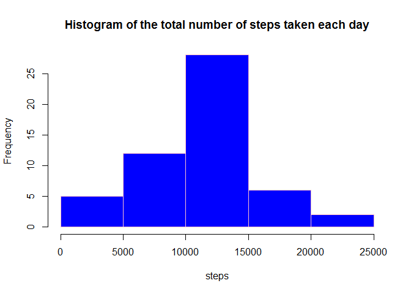
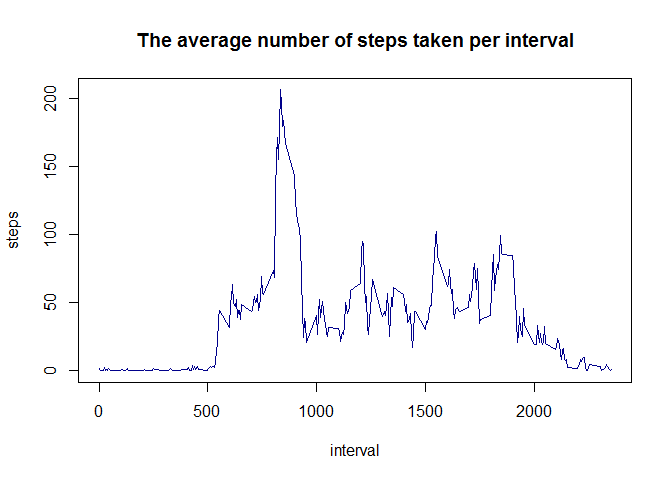
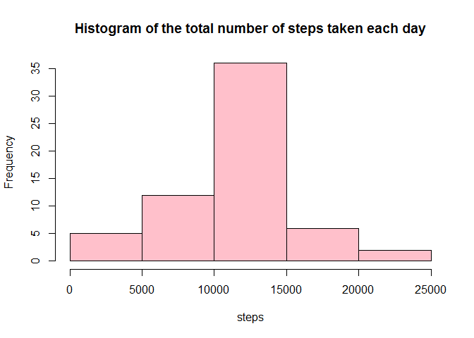
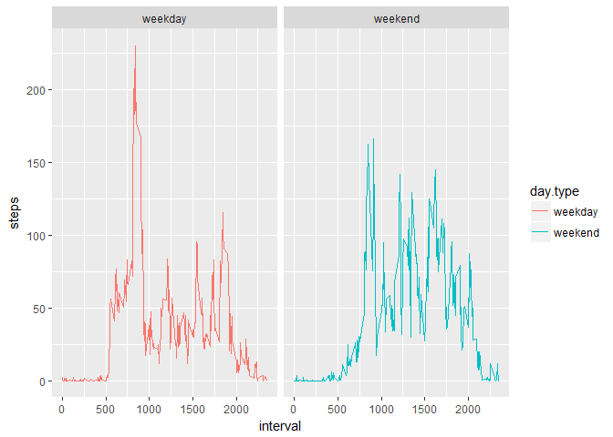

# Activity analysis based on steps taken
Anna Wrona  
3 May 2018  


###Description:
Data collected from a personal activity monitoring device. This device collects data at 5 minute intervals through out the day. The data consists of two months of data from an anonymous individual collected during the months of October and November, 2012 and include the number of steps taken in 5 minute intervals each day.

The variables included in this dataset are:

  * **steps:** Number of steps taking in a 5-minute interval (missing values are coded as NA)
  * **date:** The date on which the measurement was taken in YYYY-MM-DD format
  * **interval:** Identifier for the 5-minute interval in which measurement was taken

## Getting data


```r
#Downloading data from given URL address
url_zip<-'https://github.com/rdpeng/RepData_PeerAssessment1/raw/master/activity.zip'
temp <- tempfile()
download.file(url_zip,temp)
data <- read.csv(unz(temp, "activity.csv"), stringsAsFactors = FALSE)
unlink(temp)
```


## Mean total number of steps taken per day

###1. Total number of steps taken per day


```r
#Creating new data frame with number of steps taken each day
df_total<-aggregate(steps~date, data = data, sum)
head(df_total)
```

```
##         date steps
## 1 2012-10-02   126
## 2 2012-10-03 11352
## 3 2012-10-04 12116
## 4 2012-10-05 13294
## 5 2012-10-06 15420
## 6 2012-10-07 11015
```

###2. Histogram


```r
hist(df_total$steps, xlab = 'steps', main = 'Histogram of the total number of steps taken each day', col = 'blue', border = 'pink')
```

<!-- -->

###3. Mean and median of steps taken per day

```r
steps_mean<-round(mean(df_total$steps),4)
steps_median<-round(median(df_total$steps),2)
```

**Mean number of steps taken per day equals to 1.0766189\times 10^{4}. Median number of steps taken per day equals to 1.0765\times 10^{4}**

## The average daily activity pattern


###1. Time series plot of the 5-minute interval and the average number of steps taken, averaged across all days 


```r
df_intv<-aggregate(steps~interval, data=data, mean)
df_intv$steps<-round(df_intv$steps, digits = 2)
plot(df_intv$interval, df_intv$steps, type='l', col='dark blue', 
     main='The average number of steps taken per interval', xlab = 'interval', ylab = 'steps')
```

<!-- -->


###2. 5-minute interval with the maximum number of steps


```r
max_intv<-df_intv[df_intv$steps==max(df_intv$steps),1]
max_intv
```

```
## [1] 835
```

**Interval with maximum number of steps is 835.**

## Imputing missing values

###1. The total number of missing values in the dataset

```r
na_num<-sum(is.na(data))
na_num
```

```
## [1] 2304
```
**Total number of NA's is equal to 2304.**


###2. A new dataset that is equal to the original dataset but with the missing data filled in using the mean for that 5-minute interval

```r
new_df<-data

for ( i in 1:length(new_df$steps)){
  x<-new_df[i,1]
  if (is.na(x)==TRUE){
    new_df[i,1]<-df_intv[which(df_intv$interval==new_df[i,3]),2]
  }
}
#cheking if there is any missing data left
sum(is.na(new_df))
```

```
## [1] 0
```

###3. Histogram of the total number of steps taken each day 


```r
newdf_total<-aggregate(steps~date, data = new_df, sum)
hist((newdf_total$steps), xlab = 'steps', main = 'Histogram of the total number of steps taken each day', col='pink')
```

<!-- -->


###4. The mean and median total number of steps taken per day

```r
new_mean<-round(mean(newdf_total$steps),4)
new_median<-round(median(newdf_total$steps),2)
```


```r
dif_mean<-new_mean-steps_mean
dif_median<-new_median-steps_median
if(dif_mean>0){
  m1<-'higher'
}else{
  m1<-'lower'
}
if(dif_median>0){
  m2<-'higher'
}else{
  m2<-'lower'
}
```

**Values slightly differ from previously calculated. New mean is equal to 1.0766181\times 10^{4} and is lower than the one with missing values omitted. New median is equal to 1.076613\times 10^{4} and is higher than the one with missing values omitted.**

## Are there differences in activity patterns between weekdays and weekends?


###1. Creating a new factor variable in the dataset with two levels - "weekday" and "weekend".


```r
df_w<-data.frame(new_df, W=weekdays(as.Date(new_df$date)))
df_w<-within(df_w, day.type<-as.factor(ifelse(W=="Sunday"|W=="Saturday", "weekend", "weekday")))
head(df_w)
```

```
##   steps       date interval      W day.type
## 1  1.72 2012-10-01        0 Monday  weekday
## 2  0.34 2012-10-01        5 Monday  weekday
## 3  0.13 2012-10-01       10 Monday  weekday
## 4  0.15 2012-10-01       15 Monday  weekday
## 5  0.08 2012-10-01       20 Monday  weekday
## 6  2.09 2012-10-01       25 Monday  weekday
```

###2.  A panel plot containing a time series plot of the 5-minute interval (x-axis) and the average number of steps taken, averaged across all weekday days or weekend days (y-axis).


```r
df_w_intv<-aggregate(steps~interval+day.type, df_w, mean)
library(ggplot2)
ggplot(df_w_intv, aes(x=interval, y=steps, colour=day.type))+geom_line()+facet_wrap( ~ day.type)
```

<!-- -->


**There is much higher average number of steps taken at weekdays visible especially for interval between 500 and 1000.**


